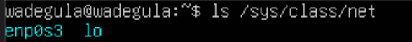
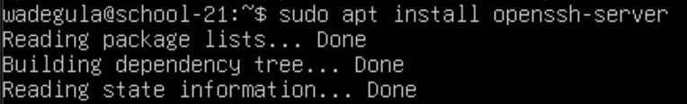

## Задача 1: Установите Ubuntu 20.04 Server LTS без графического интерфейса. (Используйте VirtualBox).
* Графического интерфейса быть не должно.
* Проверьте версию Ubuntu, выполнив команду cat /etc/issue.
* Добавьте в отчет снимок экрана с выводом команды.

### Решение:
1. Установил Ubuntu 20.04 Server LTS без графического интерфейса в VirtualBox.
2. Выполнил команду cat /etc/issue.

## Задача 2: Создайте пользователя, отличного от созданного во время установки. Пользователь должен быть добавлен в admгруппу.
* Добавьте снимок экрана вызова команды для создания пользователя.
* Новый пользователь должен присутствовать в выводе команды: cat /etc/passwd.
* Добавьте снимок экрана с выводом команды.

### Решение:

## Задача 3: 

    1. Установите имя машины как user-1.
### Решение:
Запустил vim и изменил имя.

    2. Установите часовой пояс, соответствующий вашему текущему местоположению.
### Решение:
Установил и проверил.

    3. Выведите имена сетевых интерфейсов с помощью консольной команды. В отчете дайте пояснение по поводу наличия интерфейса lo.
### Решение:
lo (loopback device) – виртуальный интерфейс, присутствующий по умолчанию в любом Linux. Он используется для отладки сетевых программ и запуска серверных приложений на локальной машине. С этим интерфейсом всегда связан адрес 127.0.0.1. У него есть dns-имя – localhost.

    4. Используйте консольную команду, чтобы получить IP-адрес устройства, с которым вы работаете, от DHCP-сервера. Расшифруйте DHCP в отчете.
### Решение:

Для работы ifconfig ввел команду и запустил.

Dynamic Host Configuration Protocol (DHCP) — это протокол клиент/сервер, который автоматически предоставляет хост Интернет-протокола (IP) с его IP-адресом и другой соответствующей информацией о конфигурации, такой как маска подсети и шлюз по умолчанию.

    5. Определите и отобразите внешний IP-адрес шлюза (ip) и внутренний IP-адрес шлюза, также известный как IP-адрес по умолчанию (gw).
Узнаем внешний IP.

Узнаем внутренний IP.

    6. Установите статические (заданные вручную, а не полученные от DHCP-сервера) настройки IP, GW, DNS (используйте публичные DNS-серверы, например, 1.1.1.1 или 8.8.8.8).
### Решение:
Заходим в vim, меняем и применяем настройки.

    7. Перезагрузите виртуальную машину. Убедитесь, что статические сетевые настройки (ip, gw, dns) соответствуют заданным в предыдущем пункте.
Перезагружаем shutdown -r now и пингуем.

## Задача 4: Обновление ОС
* Обновите системные пакеты до последней версии. После обновления системных пакетов, если вы снова введете команду обновления, должно появиться сообщение об отсутствии обновлений; Добавьте снимок экрана этого сообщения к отчету.
### Решение:
Обновили и убедились.

## Задача 5: Использование команды sudo.
**Разрешить пользователю, созданному в Части 2 , выполнять команду sudo.**

    1. В отчете объясните истинное назначение команды sudo (не пишите о том, что это слово «магическое»).
### Решение:
sudo — это утилита, предоставляющая привилегии root для выполнения административных операций в соответствии со своими настройками. Она позволяет легко контролировать доступ к важным приложениям в системе.

    2. Измените имя хоста ОС с помощью пользователя, созданного в Части 2 (используя sudo).
    3. Добавьте в отчет снимок экрана с измененным именем хоста.
### Решение:
Дал права пользователю dima. Изменил имя хоста и убедился в этом.

## Задача 6: Установка и настройка службы времени.
**Настройте службу автоматической синхронизации времени.**

    1. Выведите время часового пояса, в котором вы в данный момент находитесь.
    2. Вывод следующей команды должен содержать NTPSynchronized=yes: timedatectl show
    3. Добавьте в отчет скриншоты правильного времени и вывода команды.
### Решение:
Включили синхранизацию и вывели результат.

## Задача 7: Установка и использование текстовых редакторов.
    1. Установите текстовый редактор VIM (+ любые два других, если вам нравятся NANO , MCEDIT , JOE и т. д.)
### Решение:

    2. Используя каждый из трех выбранных редакторов, создайте файл test_X.txt , где X — имя редактора, в котором создан файл. Впишите в него свой ник, закройте файл и сохраните изменения.
* Добавьте скриншоты к отчету: каждого редактора с содержимым файла перед закрытием.
* Запишите в отчете, что вы сделали для выхода с сохраненными изменениями.

### Решение:
VIM. Создание txt, запись и выход с сохранением :wq

NANO. Создание txt, запись и выход с сохранением ctrl+o, ctrl+x

JOE. Создание txt, запись и выход с сохранением ctrl+k, ctrl+c

    3. Используя каждый из трех выбранных редакторов, откройте файл для редактирования, отредактируйте файл, заменив псевдоним на строку «21 School 21», закройте файл, не сохраняя изменения.
* Добавьте скриншоты к отчету: каждого редактора с содержимым файла после редактирования.
* Запишите в отчете, что вы сделали, чтобы выйти без сохранения изменений.

### Решение:
VIM. Выход без сохранением :q!

NANO. Выход без сохранением ctrl+x + N

JOE. Выход без сохранением ctrl+c + Y

    4. Используя каждый из трех выбранных редакторов, отредактируйте файл еще раз (аналогично предыдущему пункту), а затем освойте функции поиска по содержимому файла (слову) и замены слова на любое другое.
* Добавьте скриншоты к отчету:
    * каждого редактора с результатами поиска слов.
    * o каждом редакторе с введенными командами для замены одного слова другим.

### Решение:
VIM. Поиск /текст. Замена текст на текст2: :s/текст/текст2

NANO. Поиск ctrl+w и вводим текст поиска. Замена текст на текст2: ctrl+\ + текст + текст2 + Y

JOE. Поиск ctrl+k+f + текст + B, замена текст на текст2 ctrl+k+f + текст + R + текст2 + Y

## Задача 8: Установка и базовая настройка сервиса SSHD.

    1. Установите службу SSHd.
### Решение:
Установка ssh.

Установка OpenSSH.

    2. Добавить автоматический запуск службы при каждой загрузке системы.
### Решение: 

И выводим статус.

    3. Сбросьте службу SSHd на порт 2022.
### Решение: 
Заходим в конфиг.

Меняем 22 на 2022.

Перезапуск SSH.

Проверяем изменения.

netstat - показывает информацию о сетевых соединениях, маршрутизации и статистике сетевых протоколов
Использованные ключи команды netstat:
t - Показывает активные TCP-соединения
a - Показывает всех активных подключений TCP и UDP, включая прослушиваемые порты
n - Отображает активные подключения TCP с числовыми значениями для адресов и портов вместо имени хоста

    4. Покажите наличие процесса sshd с помощью команды ps. Для этого нужно сопоставить ключи с командой.
* Объясните в отчете значение команды и каждой клавиши в ней.
### Решение: 

ps - выводит список текущих процессов на вашем сервере в виде таблицы.

a - выбрать все процессы, кроме фоновых.

u - выбрать процессы пользователя.

x - заставляет ps перечислить все процессы, принадлежащие вам.

    5. Перезагрузите систему.
* Опишите в отчете, что вы сделали для выполнения всех пяти пунктов (это можно сделать текстом или с помощью снимков экрана);
* Вывод команды netstat -tan должен содержать tcp 0 0.0.0.0:2022 0.0.0.0:* LISTEN (если команды netstat нет, ее необходимо установить);
* Добавьте в отчет снимок экрана с выводом команды;
* Объясните значение ключей -tan, значение каждого выходного столбца, значение 0.0.0.0. в отчете.

tcp - указывает на использование протокола TCP.

tcp6 - указывает на использование протокола TCP с IPv4, и IPv6.

0.0.0.0:2022 - адрес и порт, на котором слушает сервер.

LISTEN - состояние порта, в данном случае, служба ждет входящих соединений.

0.0.0.0:* - обозначает, что сервер принимает соединения на любом доступном интерфейсе для указанного порта.

## Задача 9: Установка и использование утилит top , htop.
**Установите и запустите утилиты top и htop.**
1. Из вывода верхней команды определите и запишите в отчет:
* время безотказной работы.
* количество авторизованных пользователей.
* средняя загрузка системы.
* общее количество процессов.
* загрузка процессора.
* загрузка памяти.
* pid процесса с наибольшим использованием памяти.
* pid процесса, потребляющего больше всего процессорного времени.

up - время безотказной работы: 35 min.

user - количество авторизованных пользователей: 1

load average средняя загрузка системы: 0.04

Tasks XX total - общее количество процессов: 138

Cpu(s) - загрузка процессора: 0.0 us

Mem - загрузка памяти: 415.2 used

top -o %MEM

top -o %CPU

2. Добавьте в отчет снимок экрана вывода команды htop:
* сортировка по PID, PERCENT_CPU, PERCENT_MEM, TIME.

F6

* отфильтровано для процесса sshd.

F4

* с процессом syslog, найденным путем поиска.

F3

* с добавленным выводом имени хоста, часов и времени безотказной работы.

F2

## Задача 10: Использование утилиты fdisk.
**Запустите команду fdisk -l. В отчете укажите название жесткого диска, его емкость и количество секторов, а также размер раздела подкачки.**

### Решение: 
Имя, емкость и количество секторов.

Размер раздела подкачки 0.

## Задача 11: Использование утилиты df.
**Выполните команду df.**
* В отчете для корневого раздела (/) напишите:
    * размер раздела
    * используемое пространство
    * свободное пространство
    * процент использованного
* Определите и запишите в отчете единицу измерения. 

### Решение: 

    Данные корневого раздела (/):
    размер раздела: 8872108 Kb
    размер занятого пространства: 2555960 Kb
    размер свободного пространства: 5843880 Kb
    процент использования: 31%
    Единица измерения килобайты

**Выполните команду df -Th.**
* В отчете для корневого раздела (/) напишите:
    * размер раздела
    * используемое пространство
    * свободное пространство
    * процент использованного
* Определите и запишите в отчет тип файловой системы раздела.

### Решение: 

    Данные корневого раздела (/):
    размер раздела: 8.5 Gb
    размер занятого пространства: 2.5 Gb
    размер свободного пространства: 5.6 Gb
    процент использования: 31%
    Tип файловой системы ext4

## Задача 11: Использование утилиты du.
1. Выполните команду du.

2. Вывести размер папок /home, /var, /var/log (в байтах, в удобном для чтения формате)

3. Вывести размер всего содержимого в /var/log (не общий размер, а каждый вложенный элемент, используя *).

## Задача 13: Установка и использование утилиты ncdu.

1. Установите утилиту ncdu.
2. Вывести размер папок /home, /var, /var/log.
* Размер должен быть примерно таким же, как в Части 12.
* Добавьте в отчет скриншоты использованных команд.

### Решение: 
Установил ncdu.

Выводим размер папки /home

Выводим размер папки /var

Выводим размер папки /var/log

## Задача 14: Работа с системными журналами.

**Открыл для просмотра:**
1. /var/log/dmesg
2. /var/log/syslog
3. /var/log/auth.log
* Запишите в отчет время последнего успешного входа в систему, имя пользователя и способ входа.
* Перезапустите службу SSHd.
* Добавьте в отчет снимок экрана сообщения о перезапуске службы (поищите его в журналах).

### Решение: 
Открывал командой less /путь
Последний успешный вход, имя пользователя и способ входа.

Перезапустил службу SSHd.

Сообщения о перезапуске службы в less /var/log/syslog.

## Задача 15: Использование планировщика заданий CRON.

1. Используя планировщик заданий, запускайте команду uptime каждые 2 минуты.
    * Найдите строки в системных журналах (не менее двух в указанном диапазоне времени) о выполнении.
    * Отображение списка текущих заданий для CRON.
    * Добавьте в отчет скриншоты строк выполнения и список текущих задач.

### Решение: 
Добавил задачу crontab -e

Отчет journalctl -u cron.servise

2. Удалите все задачи из планировщика заданий.
    * Добавьте в отчет снимок экрана списка текущих задач для CRON.

### Решение: 
Удалил все задачи командой crontab -r

