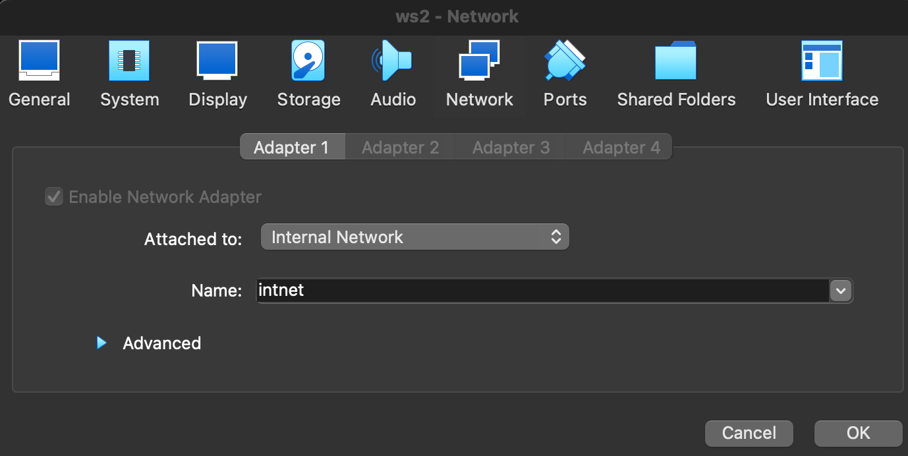
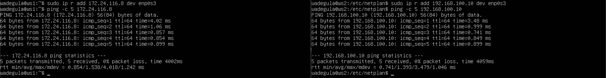
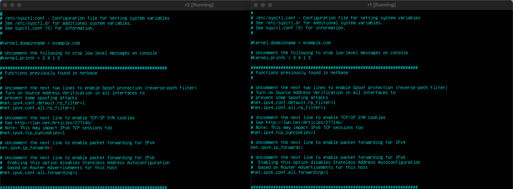
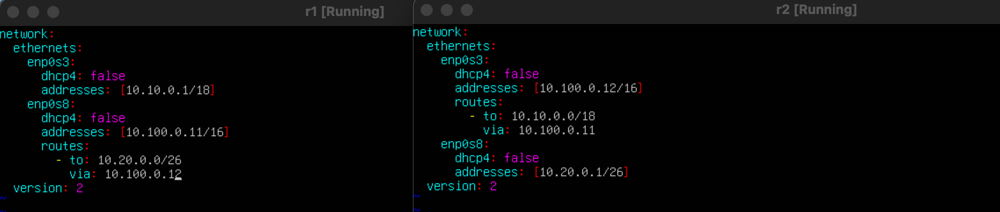
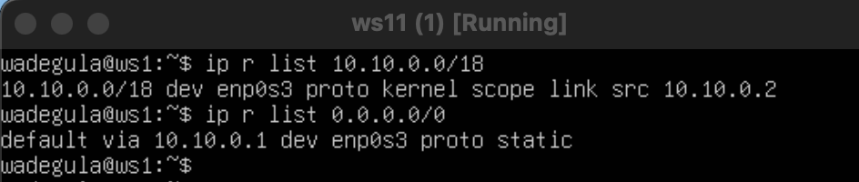
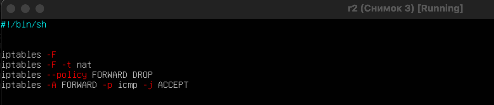

## Part 1. Инструмент ipcalc

1.1. Сети и маски

Определи и запиши в отчёт:  

    1) Адрес сети 192.167.38.54/13

Установка ipcalc

ipcalc предоставляет простой метод для вычисления IP-информации хоста.

    2) Перевод маски 255.255.255.0 в префиксную и двоичную запись, /15 в обычную и двоичную, 11111111.11111111.11111111.11110000 в обычную и префиксную

ipcalc 255.255.255.0

ipcalc 0.0.0.0/15

ipcalc 0.0.0.0/28

    3) Минимальный и максимальный хост в сети 12.167.38.4 при масках: /8, 11111111.11111111.00000000.00000000, 255.255.254.0 и /4

  
1.2. localhost

    Определи и запиши в отчёт, можно ли обратиться к приложению, работающему на localhost, со следующими IP: 194.34.23.100, 127.0.0.2, 127.1.0.1, 128.0.0.1

* 194.34.23.100 -
* 127.0.0.2 +
* 127.1.0.1 +
* 128.0.0.1 -

  
1.3. Диапазоны и сегменты сетей

Определи и запиши в отчёт:

    1) Какие из перечисленных IP можно использовать в качестве публичного, а какие только в качестве частных: 10.0.0.45, 134.43.0.2, 192.168.4.2, 172.20.250.4, 172.0.2.1, 192.172.0.1, 172.68.0.2, 172.16.255.255, 10.10.10.10, 192.169.168.1

* 10.0.0.45 частный
* 134.43.0.2 публичный
* 192.168.4.2 частный
* 172.20.250.4 частный
* 172.0.2.1 публичный
* 192.172.0.1 публичный
* 172.68.0.2 публичный
* 172.16.255.255 частный
* 10.10.10.10 частный
* 192.169.168.1 публичный

    2) Какие из перечисленных IP-адресов шлюза возможны у сети 10.10.0.0/18: 10.0.0.1, 10.10.0.2, 10.10.10.10, 10.10.100.1, 10.10.1.255

* 10.0.0.1 -
* 10.10.0.2 +
* 10.10.10.10 +
* 10.10.100.1 -
* 10.10.1.255 +

## Part 2. Статическая маршрутизация между двумя машинами

  
2.0. ws2

    1) Подними две виртуальные машины (далее -- ws1 и ws2).

    2) С помощью команды ip a посмотри существующие сетевые интерфейсы. В отчёт помести скрин с вызовом и выводом использованной команды.

    3) Опиши сетевой интерфейс, соответствующий внутренней сети, на обеих машинах и задай следующие адреса и маски: ws1 — 192.168.100.10, маска /16, ws2 — 172.24.116.8, маска /12. В отчёт помести скрины с содержанием изменённого файла etc/netplan/00-installer-config.yaml для каждой машины.

Изменил настройки сети и вызвал sudo vim etc/netplan/00-installer-config.yaml на обеих машинах и задал адреса и маски:

* ws1: 192.168.100.10/16
* ws2: 172.24.116.8/12

    4) Выполни команду netplan apply для перезапуска сервиса сети. В отчёт помести скрин с вызовом и выводом использованной команды.

  
2.1. Добавление статического маршрута вручную

    Добавь статический маршрут от одной машины к другой и обратно с помощью команды вида ip r add. Пропингуй соединение между машинами. В отчёт помести экран с вызовом и выводом использованных команд.

  
2.2. Добавление статического маршрута с сохранением

    0) Перезапусти машины.

Перезагрузил командой shutdown -r now

    1) Добавим статический маршрут от одной машины к другой с помощью файла /etc/netplan/00-installer-config.yaml. В отчёт помести скрин с изменением изменённого файла /etc/netplan/00-installer-config.yaml.

    2) Пропингуй соединение между машинами. В отчёт помести экран с вызовом и выводом использованной команды.

## Part 3. Утилита iperf3

  
3.1. Скорость соединения

    Переведи и запиши в отчёт: 8 Мбит/с в МБ/с, 100 МБ/с в Кбит/с, 1 Гбит/с в Мбит/с.

8 Мбит/с = 1 МБ/с
100 МБ/с = 800000 Кбит/с 
1 Гбит/с = 1000 Мбит/с

  
3.2. Утилита iperf3

    Измерьте скорость соединения между ws1 и ws2. В отчёт помести экран с вызовом и выводом использованных команд.

## Part 4. Сетевой экран

  
4.1. Утилита iptables

    Необходимо добавить в файл подряд следующие правила:

    1) В ws1 применяется ограничение, когда в начале пишется запрещающее правило, а в конце пишется разрешающее правило (это касается пунктов 4 и 5).
    2) В ws2 применяется изменение, когда вначале пишется разрешающее правило, а в конце пишется запрещающее правило (это касается пунктов 4 и 5).
    3) Открой на машинах доступ для порта 22 (ssh) и порта 80 (http).
    4) Запретить эхо-ответ (машина не должна «пинговаться», т. е. должна быть блокировка на OUTPUT).
    5) Разреши эхо-ответ (машина должна «пинговаться»).
    В отчёт помести скрины с изменением файла /etc/firewall для каждой машины.

    Загрузить файлы для разговоров с командами машин chmod +x /etc/firewall.sh и /etc/firewall.sh.
    В отчёт помести экраны с запуском обоих файлов.
    В отчёте описаны различия между стратегиями, примененёнными в первом и втором файлах.

Ввел sudo chmod +x /etc/firewall.sh и запустил

  
4.2. Утилита nmap

Командой ping найди машину, которая не «пингуется», после чего утилитой nmap покажи, что хост-машина запущена.
Проверка: в выводе nmap должно быть указано:Host is up.
В отчёт помести экраны с вызовом и выводом использованных команд ping и nmap.

Сохрани дампы образов виртуальных машин

## Part 5. Статическая маршрутизация сети

  
5.1. Настройка адресов машин

    1) Настройте конфигурацию машины в etc/netplan/00-installer-config.yaml в соответствии с сетью на рисунке.
    В отчёте есть экраны с изменением файла etc/netplan/00-installer-config.yaml для каждой машины.

    2) Перезапусти сервис сети. Если ошибок нет, команда ip -4 a проверит, что адрес, заданный машине, верен. Также пропингуй ws22 с ws21. Аналогично пропингуй r1 с ws11.
    В отчёт помести экран с вызовом и выводом использованных команд.

  

  
5.2. Включение переадресации IP-адресов

    1) Для включения переадресации IP выполни команду на роутерах: sysctl -w net.ipv4.ip_forward=1
    При таком подходе переадресация не будет работать после перезагрузки системы. В отчёт помести скрин с вызовом и выводом использованной команды.

    2) Открой файл /etc/sysctl.conf и добавь в него следующую строку: net.ipv4.ip_forward = 1
    При использовании этого подхода, IP-переадресация включена на постоянной основе. В отчёт помести скрин с содержанием изменённого файла /etc/sysctl.conf.

    

  
5.3. Установка маршрута по умолчанию

    1) Пример вывода команды ip r после добавления шлюза:
    default via 10.10.0.1 dev eth0
    10.10.0.0/18 dev eth0 proto kernel scope link src 10.10.0.2
    Настрой маршрут по умолчанию (шлюз) для рабочих станций. Для этого добавь default перед IP-роутера в файле конфигураций.
    В отчёт помести скрин с содержанием файла etc/netplan/00-installer-config.yaml;

    2) Вызови ip r и покажи, что добавился маршрут в таблицу маршрутизации.
    В отчёт помести скрин с вызовом и выводом использованной команды.

    3) Пропингуй с ws11 роутер r2 и покажи на r2, что пинг доходит. Для этого используй команду: tcpdump -tn -i eth0. В отчёт помести скрин с вызовом и выводом использованных команд.

  
5.4. Добавление статических маршрутов

    1) Добавь в роутеры r1 и r2 статические маршруты в файле конфигураций.

 
    2) Вызови ip r и покажи таблицы с маршрутами на обоих роутерах.

    
    3) Запусти команды на ws11:
    ip r list 10.10.0.0/[маска сети] и ip r list 0.0.0.0/0

    В отчёт помести скрин с вызовом и выводом использованных команд;
    В отчёте объясни, почему для адреса 10.10.0.0/[маска сети] был выбран маршрут, отличный от 0.0.0.0/0, хотя он попадает под маршрут по умолчанию.

Для адреса 10.10.0.0/18 был выбран маршрут, отличный от 0.0.0.0/0, потому что при наличии нескольких маршрутов одинаковой длины выбирается тот маршрут, который задан наиболее точно.

  
5.5. Построение списка маршрутизаторов

    1) Запусти на r1 команду дампа: tcpdump -tnv -i eth0
    При помощи утилиты traceroute построй список маршрутизаторов на пути от ws11 до ws21.
    В отчёт помести скрины с вызовом и выводом использованных команд (tcpdump и traceroute).
    В отчёте, опираясь на вывод, полученный из дампа на r1, объясни принцип работы построения пути при помощи traceroute.

Traceroute — это утилита, которая позволяет проследить маршрут следования данных до удаленного адресата в сетях TCP/IP. При помощи этих команд можно увидеть путь пакета данных от вашего компьютера до целевого сервера или сайта.

  
5.6. Использование протокола ICMP при маршрутизации

    1) Запусти на r1 перехват сетевого трафика, проходящего через eth0 с помощью команды: tcpdump -n -i eth0 icmp
    Пропингуй с ws11 несуществующий IP (например, 10.30.0.111) с помощью команды: ping -c 1 10.30.0.111
    В отчёт помести скрин с вызовом и выводом использованных команд.

    2) Сохрани дампы образов виртуальных машин.
    P.S. Ни в коем случае не сохраняй дампы в гит!

Сделал снимки с именем "2"

## Part 6. Динамическая настройка IP с помощью DHCP

  
Знакомство со службой DHCP

    1) Для r2 настрой в файле /etc/dhcp/dhcpd.conf конфигурацию службы DHCP:
    Укажи адрес маршрутизатора по умолчанию, DNS-сервер и адрес внутренней сети. Пример файла для r2:

    subnet 10.100.0.0 netmask 255.255.0.0 {}
    subnet 10.20.0.0 netmask 255.255.255.192
    {
        range 10.20.0.2 10.20.0.50;
        option routers 10.20.0.1;
        option domain-name-servers 10.20.0.1;
    }

    2) В файле resolv.conf пропиши nameserver 8.8.8.8.
    В отчёт помести скрины с содержанием изменённых файлов.

    3) Перезагрузи службу DHCP командой systemctl restart isc-dhcp-server. Машину ws21 перезагрузи при помощи reboot и через ip a покажи, что она получила адрес. Также пропингуй ws22 с ws21.
    В отчёт помести скрины с вызовом и выводом использованных команд.

Перезагрузил службу.

    4) Укажи MAC-адрес у ws11, для этого в etc/netplan/00-installer-config.yaml надо добавить строки: macaddress: 10:10:10:10:10:BA, dhcp4: true.
    В отчёт помести скрин с содержанием изменённого файла etc/netplan/00-installer-config.yaml.

    5) Для r1 настрой аналогично r2, но сделай выдачу адресов с жесткой привязкой к MAC-адресу (ws11). Проведи аналогичные тесты. В отчёте этот пункт опиши аналогично настройке для r2.

    6) Запроси с ws21 обновление IP-адреса.
    В отчёте помести скрины IP до и после обновления.
    В отчёте опиши, какими опциями DHCP сервера пользовался в данном пункте.

Удаляем, даем новый IP и проверяем

    7) Сохрани дампы образов виртуальных машин.

Сохранил с именем "Снимок 3"

## Part 7. NAT

  
7.1 apache2

    1) В файле /etc/apache2/ports.conf на ws22 и r1 измени строку Listen 80 на Listen 0.0.0.0:80, то есть сделай сервер Apache2 общедоступным. В отчёт помести скрин с содержанием изменённого файла.

    2) Запусти веб-сервер Apache командой service apache2 start на ws22 и r1. В отчёт помести скрины с вызовом и выводом использованной команды.

  
7.2 Работа с firewall

    1) Добавь в фаервол, созданный по аналогии с фаерволом из Части 4, на r2 следующие правила:
    Удаление правил в таблице filter — iptables -F;
    Удаление правил в таблице «NAT» — iptables -F -t nat;
    Отбрасывать все маршрутизируемые пакеты — iptables --policy FORWARD DROP.

    2) Запусти файл также, как в Части 4.
    Проверь соединение между ws22 и r1 командой ping.
    При запуске файла с этими правилами, ws22 не должна «пинговаться» с r1. В отчёт помести скрины с вызовом и выводом использованной команды.

    3) Добавь в файл ещё одно правило:
    Разрешить маршрутизацию всех пакетов протокола ICMP.
    Запусти файл также, как в Части 4.
    Проверь соединение между ws22 и r1 командой ping.
    При запуске файла с этими правилами, ws22 должна «пинговаться» с r1.
    В отчёт помести скрины с вызовом и выводом использованной команды.

Добавил правило

    4) Добавь в файл ещё два правила:
    Включи SNAT, а именно маскирование всех локальных IP из локальной сети, находящейся за r2 (по обозначениям из Части 5 — сеть 10.20.0.0).
    Включи DNAT на 8080 порт машины r2 и добавить к веб-серверу Apache, запущенному на ws22, доступ извне сети.
    Совет: стоит учесть, что при попытке подключения возникнет новое tcp-соединение, предназначенное ws22 и 80 порту.
    В отчёт помести скрин с содержанием изменённого файла.
    Запусти файл также, как в Части 4.

И запустил sudo bash /etc/firewall.sh

    5) Проверь соединение по TCP для SNAT: для этого с ws22 подключиться к серверу Apache на r1 командой:
    telnet [адрес] [порт]
    Проверь соединение по TCP для DNAT: для этого с r1 подключиться к серверу Apache на ws22 командой telnet (обращаться по адресу r2 и порту 8080).

    6) Сохрани дампы образов виртуальных машин.

Сохранил с именем "Снимок 4"

